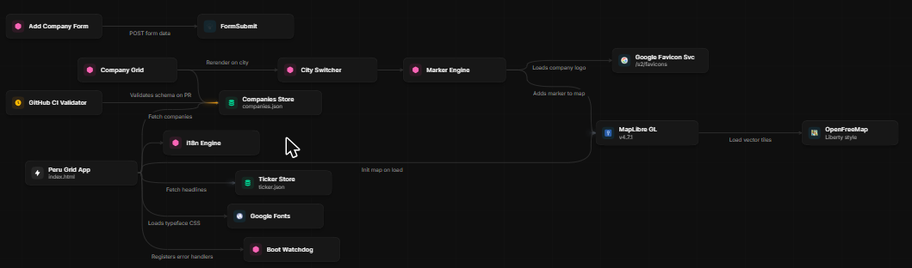

# Peru Grid

[](https://github.com/RikepilB/peru-tech-map/actions/workflows/ci.yml)
[](./LICENSE)
[](./CONTRIBUTING.md)

Un mapa interactivo de startups, consultoras tecnológicas, espacios de coworking e incubadoras en Lima y Arequipa, presentado como una consola de operaciones estilo terminal. Haz clic en un lugar para volar hacia él, haz clic en su marcador para ver detalles, cambia de ciudad desde la barra lateral. En vivo en **[perugrid.com](https://perugrid.com)**.

---

## Mapa Del Codebase

[](https://foglamp.dev/scan/peru-grid-cnhzyw)

Mapa generado por IA de la arquitectura del proyecto (servicios, stores, integraciones) — **[ver interactivo en Foglamp →](https://foglamp.dev/scan/peru-grid-cnhzyw)**

---

## Qué Es

Una aplicación web autocontenida sin paso de compilación, sin framework, sin backend. Renderiza un mapa vectorial de código abierto (MapLibre GL) y superpone un conjunto de datos investigado de empresas tecnológicas, consultoras, espacios de coworking e incubadoras peruanas. Todo el proyecto son tres archivos de datos más un archivo HTML, servidos como assets estáticos.

**Stack:**
- **[MapLibre GL JS](https://maplibre.org/)** — renderizador de mapas WebGL de código abierto (el fork abierto de Mapbox GL).
- **[OpenFreeMap](https://openfreemap.org/)** — hosting gratuito de tiles vectoriales y estilos base. Sin API key, sin límites de uso.
- Los tiles vectoriales siguen el **[esquema OpenMapTiles](https://openmaptiles.org/schema/)** (source-layers: `building`, `water`, `transportation`, `place`, `poi`, etc.).
- **[Geist Mono](https://vercel.com/font)** para toda la tipografía de la interfaz.
- **[FormSubmit](https://formsubmit.co/)** para el formulario "agregar empresa" (relay de email para sitios estáticos, sin servidor).

**Diseño:** consola monocromática casi negra con verde Solarium (`#056540`) como único acento. Vista 2D tipo plano en picado por defecto, con un toggle `[3D]`. Las etiquetas de calles solo aparecen en vías principales; los POI por defecto del mapa están ocultos para que solo se vean los marcadores de empresas.

---

## Estructura Del Repositorio

```
peru-tech-map/
├── index.html              # Toda la app: mapa, barra lateral, selector de ciudad, popovers, formulario, loader
├── companies.json          # Dataset de empresas — el corazón del proyecto
├── ticker.json             # Ticker de titulares con scroll
├── README.md               # Estás aquí
├── LICENSE                 # MIT — cubre el código
├── LICENSE-DATA            # CC BY 4.0 — cubre los datasets
├── CODEOWNERS              # Enruta cada PR al mantenedor para revisión
├── CONTRIBUTING.md         # Cómo agregar un lugar, corregir datos, o cambiar código
├── CODE_OF_CONDUCT.md      # Contributor Covenant 2.1
├── SECURITY.md             # Divulgación responsable
└── .github/
    ├── PULL_REQUEST_TEMPLATE.md
    ├── ISSUE_TEMPLATE/         # Agregar Empresa / Reportar Bug / Solicitar Funcionalidad
    └── workflows/ci.yml        # Valida companies.json/ticker.json en cada PR
```

---

## Formato De Datos

### `companies.json`

Un array de objetos de lugar. Este es el archivo que la mayoría de las contribuciones van a tocar.

```json
{
  "name": "Culqi",
  "domain": "culqi.com",
  "city": "lima",
  "address": "San Isidro, Lima",
  "lat": -12.0930, "lng": -77.0270,
  "category": "Startup",
  "subcategory": "Series A+",
  "funding": { "type": "Startup", "stage": "Series A+" },
  "tag": "Pasarela de pagos de Credicorp/BCP para aceptar tarjetas en tienda y en línea."
}
```

| Campo | Requerido | Notas |
|---|---|---|
| `name` | ✅ | Nombre a mostrar. |
| `city` | ✅ | `"lima"` o `"arequipa"` — controla el selector de ciudad y la validación de bbox. |
| `lat`, `lng` | ✅ | Grados decimales. Debe caer dentro del bbox central de esa ciudad (ver validación abajo). |
| `category` | ✅ | Taxonomía pública: `Startup`, `Incubator`, `Accelerator`, `VC`, `Nonprofit`, `Technology Consultancy` o `Coworking Space`. Describe qué es la entidad, no su estado ni una ronda. |
| `subcategory` | ⬜ | Solo para `Startup`: `Pre-Seed`, `Seed`, `Bootstrap` o `Series A+`. Omítela si no existe una fuente que respalde la etapa. |
| `funding` | ✅ (transitorio) | Campo heredado conservado durante la migración expand/contract. Los lectores prefieren `category`/`subcategory`; no uses este objeto para clasificar entradas nuevas ni borres el valor existente todavía. |
| `domain` | ⬜ | Dominio ASCII sin esquema; admite una ruta simple opcional para páginas como `linkedin.com/company/nombre`. Sin credenciales, puerto, query ni fragmento. Se enlaza mediante HTTPS y el favicon usa solo el hostname. Omítelo si no lo sabes. |
| `logo` | ⬜ | Ruta local `assets/logos/nombre.png` (también jpg/jpeg/webp/gif); nombre con letras ASCII, números, guion o guion bajo. No admite URLs externas, SVG ni rutas ascendentes. Reemplaza el favicon. |
| `address` | ⬜ | Legible por humanos, para trazabilidad. |
| `tag` | ⬜ | Descripción de una oración mostrada en el popover y usada como línea secundaria en la barra lateral. |
| `site_id`, `organization_id` | ⬜ | IDs estables de sede y organización emitidos por el paquete público de Coworking Scout. No son IDs de APIs de proveedores. |
| `workspace_type` | ⬜ | Para sedes importadas: `coworking`, `cafe` o `library`. Las tres conservan `category: "Coworking Space"` durante V1. |
| `sources` | ⬜ | Referencias públicas de Scout con URL HTTPS, fecha de observación, procedencia `public`, uso `redistributable` y elegibilidad explícita. |

**Validación De Coordenadas:** cada entrada debe caer dentro del bounding box de su ciudad —

- Lima: `[-77.20, -12.35]` → `[-76.90, -11.95]`
- Arequipa: `[-71.60, -16.50]` → `[-71.45, -16.30]`

Las entradas fuera del bbox de su ciudad declarada se omiten al cargar, con una advertencia en consola.

**Validación reproducible:** `python scripts/validate_data.py` comprueba ambos datasets sin
modificarlos: tipos estrictos, bbox, enums, campos opcionales, URLs y duplicados. `category` es
obligatorio y `subcategory` solo se admite para Startup. La lista V1 de valores está en el
validador; no asignes una etapa sin fuente. `funding` sigue validándose durante la transición.
La CI ejecuta el mismo validador y las [pruebas de seguridad del render](tests/README.md).
Los textos se muestran literalmente; validar la estructura no demuestra la veracidad del dato.

### Importar un paquete revisado de Coworking Scout

El importador acepta solo el esquema `perugrid.scout.v1` y simula por defecto:

```powershell
python scripts/import_scout.py --package ruta/scout.json
python scripts/import_scout.py --package ruta/scout.json --write
```

Antes de escribir valida el paquete, detecta conflictos por `site_id` o por nombre/ciudad/
coordenadas, construye el dataset candidato completo y ejecuta el validador de PeruGrid.
`--write` usa un reemplazo atómico; sin esa opción `companies.json` no cambia. Reimportar el
mismo paquete es un no-op. Fuentes restringidas, privadas, sin clasificar o de proveedores
Google se rechazan. El fixture de integración es sintético y no forma parte del dataset público.

### Filtros Del Mapa

El selector de ancho completo **Qué quieres ver** empieza en `Empresas`, la vista inicial que
combina `Startup` y `Technology Consultancy`. También permite elegir cada categoría pública por
separado: `Startup`, `Technology Consultancy`, `Incubator`, `Accelerator`, `VC`,
`Coworking Space` o `Nonprofit`.

Al elegir `Startup` aparece el selector dependiente **Etapa de startup**, con `Todas las etapas`,
`Pre-Seed`, `Seed`, `Bootstrap` y `Series A+`. Cambiar a otra categoría limpia cualquier etapa que
hubiera quedado seleccionada. El control **Limpiar filtros** solo aparece fuera de la vista inicial
y restaura `Empresas` sin cambiar la ciudad ni el orden. Cuando no hay coincidencias, la barra
lateral muestra un estado vacío.

### `ticker.json`

Un array de objetos de titular que se desplazan en la parte superior:

```json
{ "label": "BIOTECH", "text": "Le Qara gana el H&M Foundation Global Change Award por su biomaterial de Arequipa" }
```

Mantén `label` corto (una o dos palabras, en mayúsculas en la interfaz) y `text` en una sola oración. No se filtra por ciudad — es un reel compartido entre ambas.

---

## Ejecutarlo Localmente

La app obtiene `companies.json` y `ticker.json` en tiempo de ejecución, así que **debe servirse por HTTP** — abrir `index.html` directamente con `file://` fallará por CORS. Cualquier servidor estático funciona:

```bash
python3 -m http.server 8000
# o
npx serve .
```

Luego abre **http://localhost:8000**.

---

## TODOs Conocidos Antes De Lanzar

- **El formulario "Agregar Empresa" usa FormSubmit.** `FORM_ENDPOINT` ya está configurado en
  `index.html`; el destinatario debe mantener activa la verificación de [FormSubmit](https://formsubmit.co/).
  Cada envío se revisa manualmente antes de incorporarse al dataset.
- El favicon es un SVG inline autocontenido (data URI, no requiere archivo).
- Hay una carpeta `assets/logos/` para overrides locales de logos de empresas (campo `logo` en `companies.json`) — úsala cuando el favicon de Google sea genérico, esté en blanco o no represente bien la marca. El resto de entradas cae de vuelta al servicio de favicons de Google o a un tile con inicial.

---

## Roadmap V2

El proyecto tiene un [roadmap para V2](docs/roadmap-v2.md) — migración a una plataforma
administrada con Django + PostgreSQL, back-office interno y mapa público 3D. Ver el
[milestone V2](https://github.com/RikepilB/peru-tech-map/milestone/1) y el epic
[#23](https://github.com/RikepilB/peru-tech-map/issues/23) para el detalle.

---

## Cómo Contribuir

Las contribuciones son bienvenidas — especialmente agregar lugares, corregir coordenadas, y corregir categorías. **Cualquiera puede abrir un pull request o issue; todos los PRs son revisados y fusionados por el mantenedor.**

Consulta **[CONTRIBUTING.md](./CONTRIBUTING.md)** para el flujo completo (branching, validación,
checklist de PR), y **[CODE_OF_CONDUCT.md](./CODE_OF_CONDUCT.md)** para los estándares de la comunidad.
¿Encontraste un problema de seguridad? Consulta **[SECURITY.md](./SECURITY.md)** en vez de abrir un issue público.

---

## Créditos Y Fuentes De Datos

Datos de mapa © [OpenStreetMap](https://www.openstreetmap.org/copyright) contributors, servidos vía OpenFreeMap. Datos de empresas investigados y recopilados de fuentes públicas (sitios de las empresas, cobertura de noticias, páginas de incubadoras universitarias).

## Licencia

El **código** tiene [licencia MIT](./LICENSE). Los **datasets** (`companies.json`, `ticker.json`) tienen licencia [CC BY 4.0](./LICENSE-DATA) — las licencias de software estándar no se ajustan bien a datos factuales, por eso se licencian por separado. Los datos base del mapa son © OpenStreetMap contributors bajo [ODbL](https://www.openstreetmap.org/copyright); mantén visible el control de atribución en el mapa.
